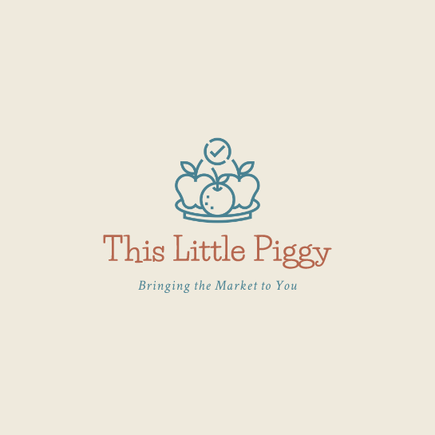

# This Little Piggy

## Introduction

This Little Piggy is an application created by a group of developers which allows customers to easily find local farmer's markets and purchase items directly from the vendors after creating a profile.

## Features

This Little Piggy offers the following features:

1. **Market Locator**: The application utilizes location services to help customers find nearby farmer's markets. Users can search for markets based on their current location or enter a specific address.

2. **Product Catalog**: Customers can explore the wide variety of fruits, vegitables, meats, poultry and artisanal goods offered by the vendors. The application includes product descriptions, pricing information, and images to help users make informed choices.  Customers can then add products to their cart.

3. **My Cart**: Customers can add products to their cart and review before checkout.

4. **Profile**: Users can sign up and create a profile to gain access to the entire application and streamline the checkout process.

## Screenshots

Here are a few screenshots showcasing the features of the This Little Piggy application:

1.  Home Page   

2.  Upcoming Markets
  
3.  Products Page 
:
:
: 
4. My Cart 

5. Sign Up 

6. Login 

Please note that these screenshots are for illustrative purposes and may not reflect the current version of the application.

## Contributors

This application was developed by the following contributors:

- [Brodi LeBlanc](https://github.com/brodi-xx)  
- [Erica Leyba](https://github.com/LeybaAir)  
- [Joey Stanion](https://github.com/Jstanion)  
- [Lanre Abu](https://github.com/lanreabu77)   
- [Russo Borneo](https://github.com/RussoB22)  
- [Stephanie Jauch](https://github.com/SKJauch)  

We express our gratitude to all contributors for their dedication and hard work in creating the This Little Piggy application.

## Technologies/Frameworks Used

The This Little Piggy application was built using the following:

-Node.js  
-Express.js  
-Sequelize  
-MySQL  
-Bootstrap   
-Handlebars    
*   
*Miro* was used to organize and streamline collaboration

## Conclusion

This Little Piggy brings the market to you by offering a convenient and user-friendly platform for customers to discover local farmer's markets and purchase fresh fruits and vegetables from vendors. With its intuitive and user friendly features, the application aims to enhance the connection between customers and local agriculture.
